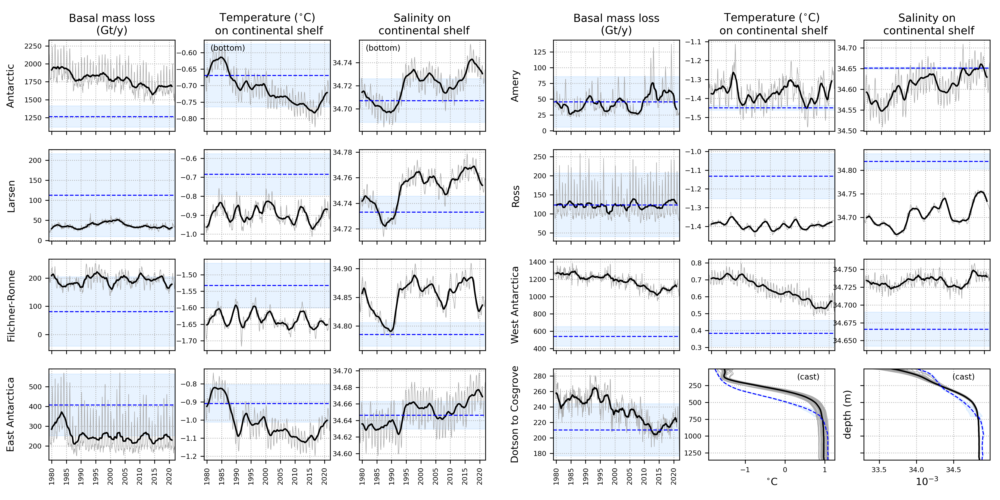
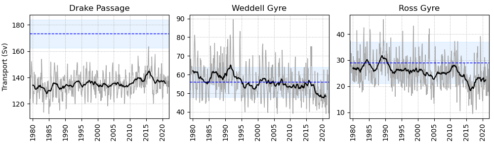
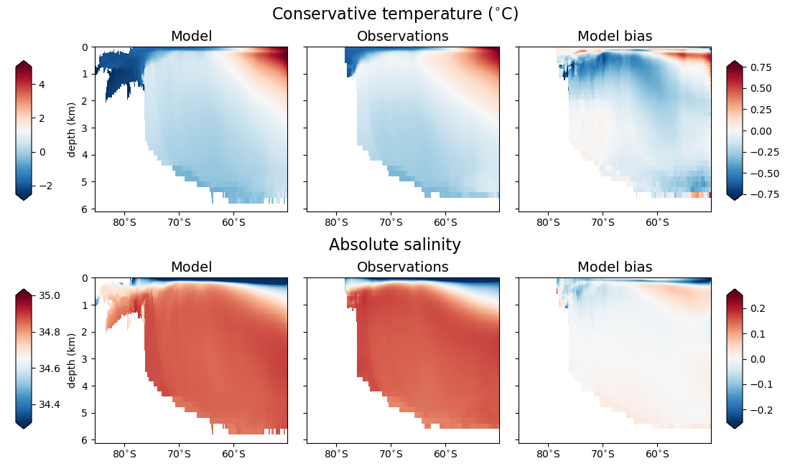
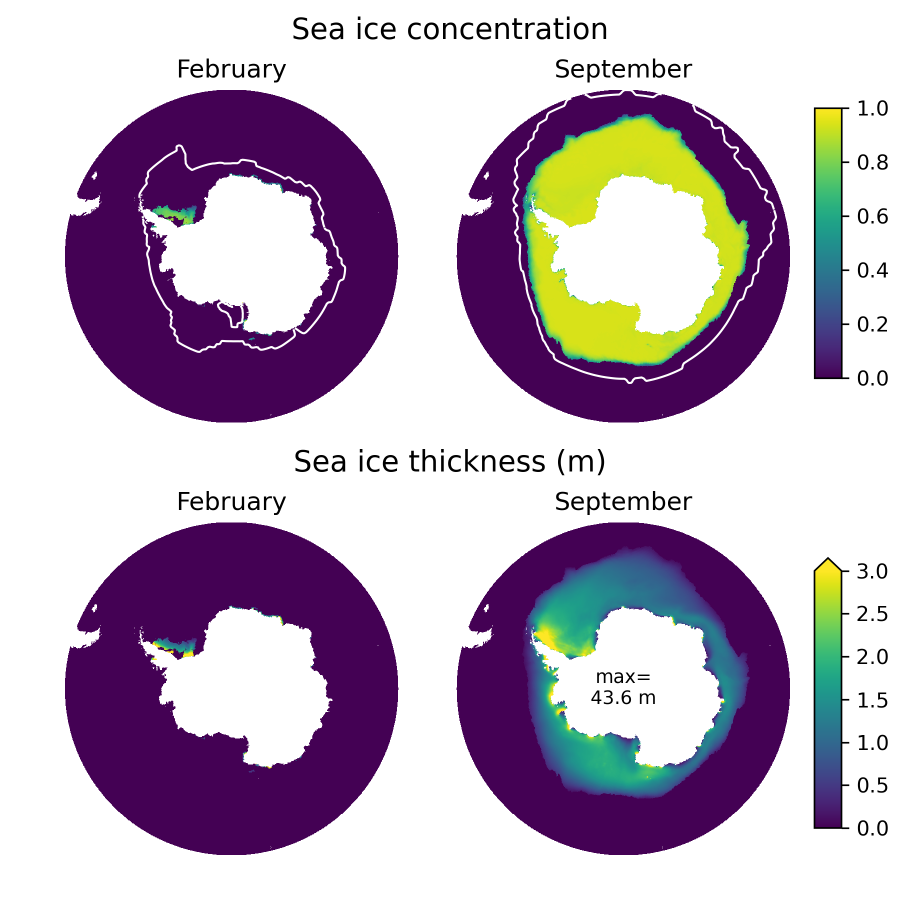

# Introduction

Here are instructions for how to generate a bunch of figures to evaluate the simulated Southern Ocean and Antarctic continental shelf against observations. This currently includes:

1. a 24-panelled timeseries plot showing ice shelf basal melting, bottom temperature, and bottom salinity in 7 regions of the continental shelf; plus basal melting and vertical casts of temperature and salinity for the Dotson to Cosgrove region (inner Amundsen Sea). Grey lines are monthly model output, black lines are the 2-year running mean, and the blue dashed lines and shaded regions are observational estimates including uncertainty (Adusumilli 2020 for basal melting, Zhou 2025 for T and S):

2. a 3-panelled timeseries plot showing transport through Drake Passage, the Weddell and Ross Gyres. Observational estimates are from Donohue 2016, Klatt 2005, and Dotto 2018:

3. a 6-panelled map showing bottom temperature and salinity in the model, observations (Zhou 2025), and the difference:

4. a 6-panelled slice plot showing zonally averaged temperature and salinity in the model, observations (WOA 2023), and the difference:

5. a 4-panelled map showing sea ice area and thickness during February (min) and September (max), with the observed ice edge (HadISST) contoured in white:

More figures are planned so check back often for updates.

This code has been tested on [Birgit Rogalla's circum-Antarctic NEMO configuration](https://github.com/brogalla/eANT025-AntArc) and UKESM suites (versions 1.2 and 1.3).

In order to use Kaitlin's precomputed gridded observations files, it must be run on JASMIN, and you must have access to the `terrafirma` group workspace. If you want to run on another system, ask Kaitlin for a copy of these files.

# 1. Download and prepare the code

Clone this repository into a directory of your choice:

      cd <some_dir>
      git clone git@github.com:knaughten/nemo_python.git

Add the following line to your `~/.bashrc` file:

     export PYTHONPATH=$PYTHONPATH:<some_dir>

Now, choose the directory you want to run the scripts in. This should be a directory including all the output files from NEMO, and you will also need write access (to save the image files). For UKESM1 suites, this directory is also assumed to be named after the suite, not including the `u-` prefix (eg, `dv346`). If someone else is hosting the output, it might be more convenient to make your own directory and link in their files. For example,

     mkdir dv346
     cd dv346
     ln -s /gws/ssde/j25b/terrafirma/tarlge/ukesm_monitoring/data/u-dv346/nemo*.nc .

In any case, you'll now need to get the top-level evaluation scripts into this directory. If you want to make changes to the scripts (eg comment out some figures, or change the budget for the queue), make a copy:

     cp <some_dir>/nemo_python/projects/evaluation_scripts/* <nemo_output_dir>

If you don't want to change anything, make a link instead (this should then automatically update to new versions if you do `git pull` on the `nemo_python` repository):

     ln -s <some_dir>/nemo_python/projects/evaluation_scripts/* <nemo_output_dir>

# 2. Precompute files for plotting

In `<nemo_output_dir>`, submit a job script to the SLURM queue. For Birgit's configuration, run

     sbatch precompute_all.sh

and for UKESM1 suites, submit the slightly different script

     sbatch precompute_all_ukesm.sh

This will precompute five things:

1. Timeseries from the model output (producing files `timeseries_T.nc` and `timeseries_U.nc`)
2. Hovmollers (depth versus time) of T and S area-averaged over one region (producing `hovmollers.nc`)
3. Bottom temperature and salinity time-averaged over the last 20 years of simulation (producing `bottom_TS_avg.nc`)
4. Zonally averaged temperature and salinity time-averaged over the last 20 years of simulation (producing `zonal_TS_avg.nc`)
5. Sea ice area and thickness during February and September, time-averaged over the last 20 years of simulation (producing `seaice_avg.nc` - not yet supported for UKESM which uses CICE instead of SI3)

If you run this job script again after NEMO has run for longer, it will update the time-dependent files from #1 and #2 as needed with any new NEMO files. However, it will delete the time-averaged files from #3-5, and remake them from scratch.

Depending on how many years you're trying to process, this can be slow. Here are some strategies to manage this:
- Set it off to finish overnight
- Split up the three steps into different jobs to run simultaneously
- If you are processing a really long run and the timeseries don't finish precomputing within 24 hours, you can just resubmit the same job again to pick up where it left off
- You might not care about the transport timeseries; to skip these, set the argument `transport=False` in the call to `update_timeseries_evaluation_NEMO_AIS` in `precompute_all.sh` (or `update_timeseries_evaluation_UKESM1` in `precompute_all_ukesm.sh`).

# 3. Make the plots

In `<nemo_output_dir>`, run:

     python plot_all.py

for Birgit's configuration, or

     python plot_all_ukesm.py

for UKESM suites.

This will create a few files `evaluation_*.png` corresponding to the evaluation figures shown above.